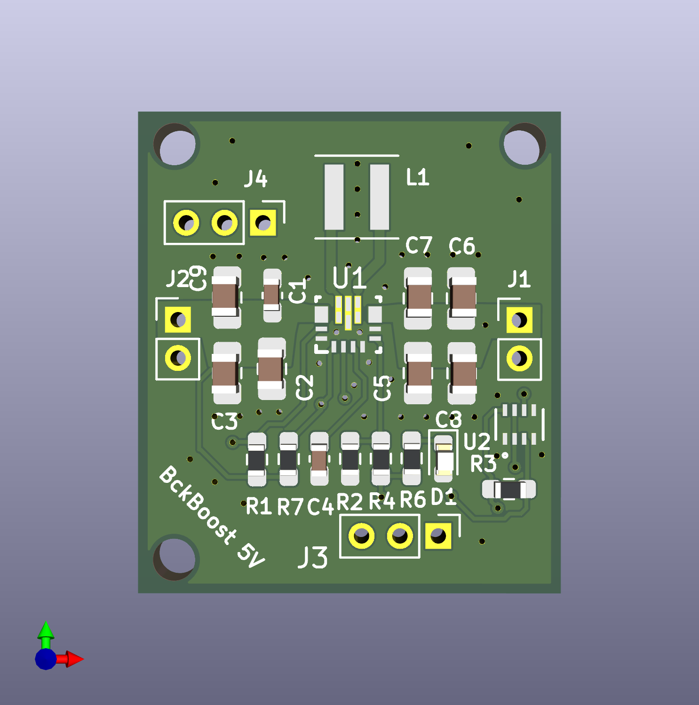

# BckBoost 5V — 5V Buck-Boost Converter

A compact, all-SMD power supply board that delivers a regulated **5 V output** from a wide input voltage range, with reverse-polarity protection via an ideal diode and a power-status LED indicator.

---

## Overview

| Parameter | Value |
|---|---|
| Input voltage (VIN) | 3 V – 16 V |
| Output voltage (VOUT) | 5 V regulated (adjustable range 2.5 V – 9 V) |
| Switching IC | TI TPS63070 buck-boost |
| Reverse-polarity protection | TI LM66200 ideal-diode controller |
| Status indicator | Red 0603 power LED (D1) |
| PCB | ~25 × 23 mm, 3× M2 mounting holes |

---

## How It Works

### Buck-Boost Converter (U1 — TPS63070)

The TPS63070 is a high-efficiency, single-inductor buck-boost converter capable of operating seamlessly whether VIN is above, below, or equal to VOUT. The output is set to 5 V via the resistor-divider feedback network on the FB pin (R1 10 kΩ / R2 68.1 kΩ) and the second divider (R4 365 kΩ) on FB2.

- **Inductor:** L1 — 1.5 µH Coilcraft XFL4020
- **Input capacitors:** C1 (0.1 µF), C2, C3, C9 (10 µF × 3) for filtering and soft-start
- **Output capacitors:** C5, C6 (10 µF + 22 µF), C7, C8 (22 µF × 2) for output regulation and ripple suppression
- **VAUX bypass:** C4 (0.1 µF) on the internal supply rail
- **PS/SYNC pin** (R7, 10 kΩ pull-up) selects power-save mode at light loads for improved efficiency
- **EN pin** (R1, 10 kΩ) is pulled high by default so the converter runs immediately on power-up; bring it low to shut down the converter

The PG (power-good) open-drain output signals when the output is in regulation — this is routed to the connector header and used to drive the power LED circuit.

### Ideal Diode — Reverse Polarity Protection (U2 — LM66200)

The LM66200 acts as an active ideal diode controller. It drives an external MOSFET (the device itself contains the FET) to present a very low forward-voltage drop (~10 mV typical) in the normal forward direction while blocking current completely if the supply is accidentally connected backwards. Compared to a Schottky diode this eliminates the typical 300–500 mV drop and the associated heat, allowing the full input range to reach the converter without power loss.

- VIN1/VIN2 are the input terminals from the external supply
- VOUT of U2 connects to VIN of U1
- The ON pin is tied to VOUT to keep the device always enabled
- Bypass capacitor C8 (22 µF) is placed on the protected output rail

### Power Status LED (D1)

A red 0603 LED is driven from the TPS63070 **PG** (power-good) signal through a current-limiting resistor R6 (1 kΩ). The LED lights up when the output is in regulation, giving a quick visual health-check. R3 (50 kΩ) provides the pull-up for the open-drain PG line.

---

## Connectors

| Reference | Pitch | Function |
|---|---|---|
| J1 | 2 mm, 1×2 | Output — 5 V + GND |
| J2 | 2 mm, 1×2 | Input — VIN + GND |
| J3 | 2 mm, 1×3 | Debug/control header (5Vout, Vin2, St) |
| J4 | 2 mm, 1×3 | Control header (Vin, PG, EN, PS) |

---

## Bill of Materials (key components)

| Ref | Value / Part | Package |
|---|---|---|
| U1 | TPS63070RNMR | 15-pin WQFN (RNM) |
| U2 | LM66200DRLR | SOT-5×3 (DRL) |
| L1 | 1.5 µH — Coilcraft XFL4020 | 4×4 mm SMD |
| C1 | 0.1 µF, 25 V | 0603 |
| C2, C3, C9 | 10 µF, 25 V | 0805 |
| C4 | 0.1 µF, 25 V | 0603 |
| C5 | 10 µF, 25 V | 0805 |
| C6, C7, C8 | 22 µF, 16 V | 0805 |
| R1, R7 | 10 kΩ, 1%, 1/10 W | 0603 |
| R2 | 68.1 kΩ, 1%, 1/10 W | 0603 |
| R4 | 365 kΩ, 1%, 1/10 W | 0603 |
| R6 | 1 kΩ, 1%, 1/10 W | 0603 |
| R3 | 50 kΩ | 0603 |
| D1 | Red LED | 0603 |
| H5–H8 | M2 mounting holes | — |

---

## Schematic & Design Files

| File | Description |
|---|---|
| `5VBuckBoost.kicad_sch` | KiCad 9 Schematic |
| `5VBuckBoost.kicad_pcb` | KiCad 9 PCB Layout |
| `5VBuckBoost.kicad_pro` | KiCad 9 Project File |

---

## Notes

- The output voltage can be changed by adjusting the R1/R2/R4 feedback divider values according to the TPS63070 datasheet formula.
- Do not exceed 16 V on the input. The LM66200's maximum rated VIN is 18 V but the TPS63070 is rated to 16 V, making that the practical system limit.
- All capacitors on the output rail should be X5R or X7R ceramic for stable capacitance across voltage and temperature.
- Designed with KiCad 9 
